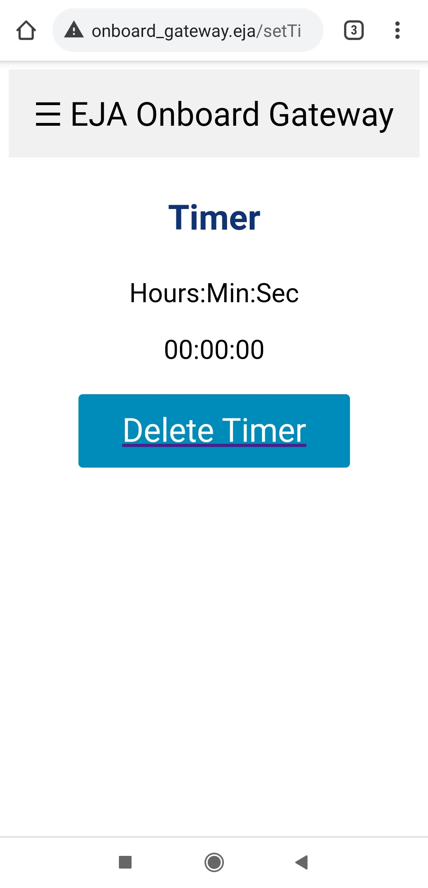
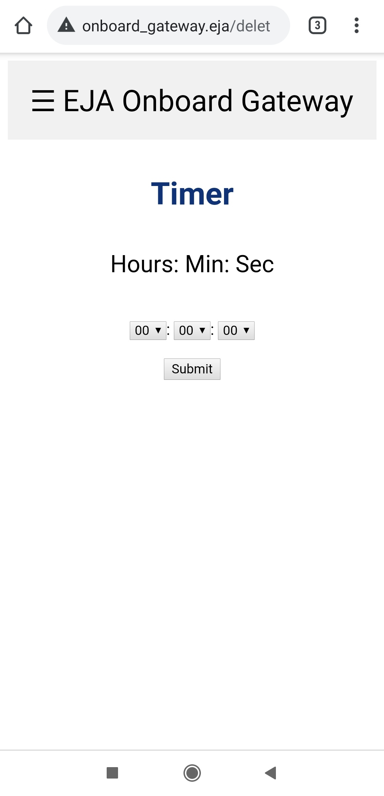

# EJA Onboard Gateway - Firmware

EJA Onboard Gateway - Firmware - 2020 Hackaday Dream Team Challenge for Conservation X Labs

This repository contains the firmware (Arduino) project used with the [electronic design of the Onboard Gateway](https://github.com/leonardoward/eja-onboard-gateway-electronics).

## Requisites ##

1. [ESP32 Add-on in Arduino IDE](https://randomnerdtutorials.com/installing-the-esp32-board-in-arduino-ide-windows-instructions/)
2. [ESPAsyncWebServer](https://github.com/me-no-dev/ESPAsyncWebServer)
3. [AsyncTCP](https://github.com/me-no-dev/AsyncTCP)
4. [SPIFFS File System](https://randomnerdtutorials.com/esp32-web-server-spiffs-spi-flash-file-system/)
5. [ESP32 Async Over The Air](https://github.com/ayushsharma82/AsyncElegantOTA)
6. [LoRa](https://randomnerdtutorials.com/esp32-lora-rfm95-transceiver-arduino-ide/)

## User Interface ##

The ESP32 creates an Asynchronous Web Server, with the following credentials:

```
const char* ssid     = "EJA_Onboard_Gateway";
const char* password = "123456789";
```

With those credentials it is possible to access the WiFi network.


The ESP32 creates a Domain Name System (DNS) to assign a domain name to the web server. That means that it is not necessary to know the server IP, it is possible to access the web server using the defined domain name for the host, in this case, the name is:

```
const char* host = "www.onboard_gateway.eja";
```

Once the device (phone/computer) is connected to the server (EJA_Onboard_Gateway), open a browser and visit the following url:


```
http://www.onboard_gateway.eja/
```

### HOME ###

The previous link displays the web page used for HOME:


There is a header with the name "EJA Onboard Gateway" that opens a sidebar with links to the different test functionalities. It is also possible to access those pages using the buttons in HOME.


### GPS ###

The page http://www.onboard_gateway.eja/gps shows the data from the GPS module.


### Timer ###

The page http://www.onboard_gateway.eja/timer shows the interface to create a timer in the Buoy. The timer represents a countdown that activates the release mechanism when the time has reached zero. The initial page allows the user to set the timer.


After selecting the amount of time the user has to click the **Submit** button. That will send the information to the buoy to create a timer.


The Onboard Gateway communicates with the Buoy, and once it receives the confirmation that the timer has been properly set, it displays the countdown to the user.


In the Onboard Gateway, the countdown timer is an estimate of the one that is running in the Buoy. When the timer reaches zero, the Buoy activates the release mechanism.



The user can delete the timer at any time clicking the button **Delete Timer**. But it will only work if the Onboard Gateway has communication with the Buoy. When the user deletes the timer, it is possible to create a new one a restart the process.



### LoRa ###

The page http://www.onboard_gateway.eja/lora shows internal messages related to LoRa. In the ESP32 that information is stored in the variable:

```
String lora_all_msg = "";
```


### Terminal ###

The page http://www.onboard_gateway.eja/terminal shows internal messages. In the ESP32 that information is stored in the variable:

```
String terminal_messages = "";
```


### LED Test ###

There is an additional page http://www.onboard_gateway.eja/toggle_led_on that can be use to change the state of a LED, the GPIO port used is define in the following variable of the script:

```
#define LED_TOGGLE LED4         // Led use for togle example (toggle from web page)
```

The buttons in the page (ON and OFF) can be used to change the state of the LED.


